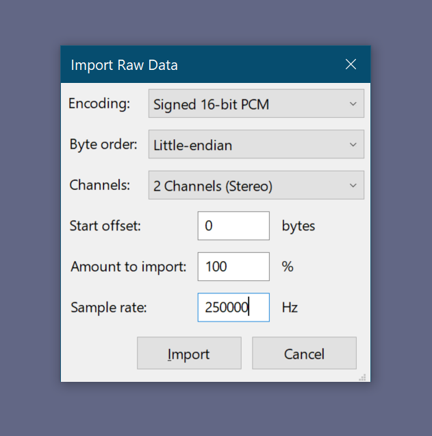
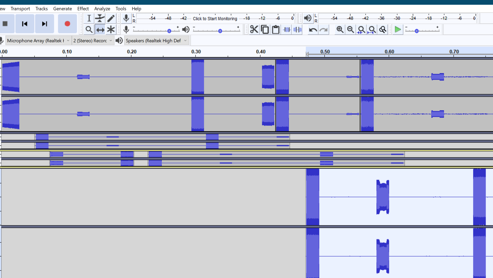
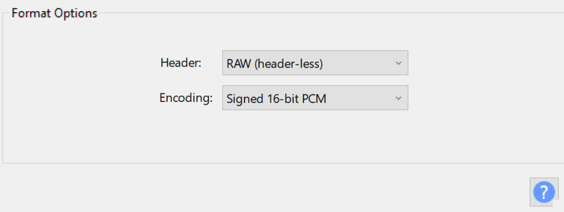
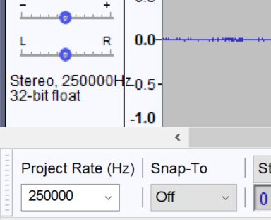

The Capture app records into C16 format. Described in the [PortaPack Wiki](https://github.com/sharebrained/portapack-hackrf/issues/139) this format is two channels of 16 bits signed integers. So, the first channel is I and second Q, forming a complex number. You end with three axis for your data, the real, the imaginary and the time (defined by the sample rate).

### Capture manipulation

You can open the C16 file in Audacity importing it as Raw data. Consider the sample rate you used when you captured.

It is possible to manipulate the data as if it was audio. You can apply filters, add silences, trim, mix and merge.

To export the data as a C16 file, select Export, Export Audio ... and then select RAW as a 16 bit signed PCM. After saving, change the extension and you will be able to use the file in the Replay app.

As a final note, if you created a new file, be sure that the Project Rate matches your capture:

