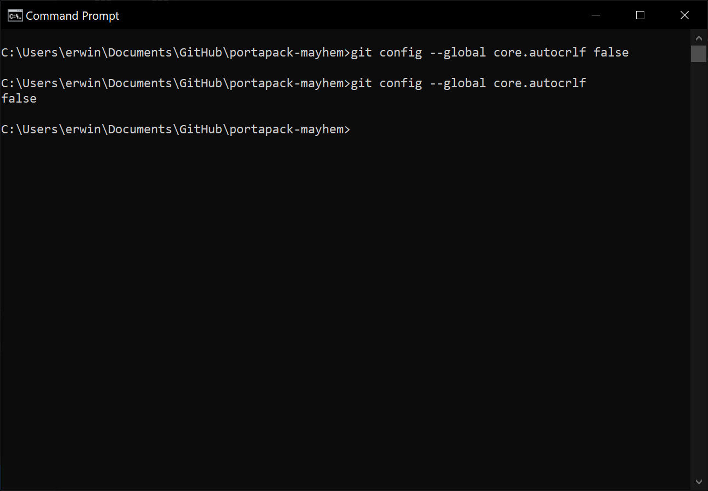
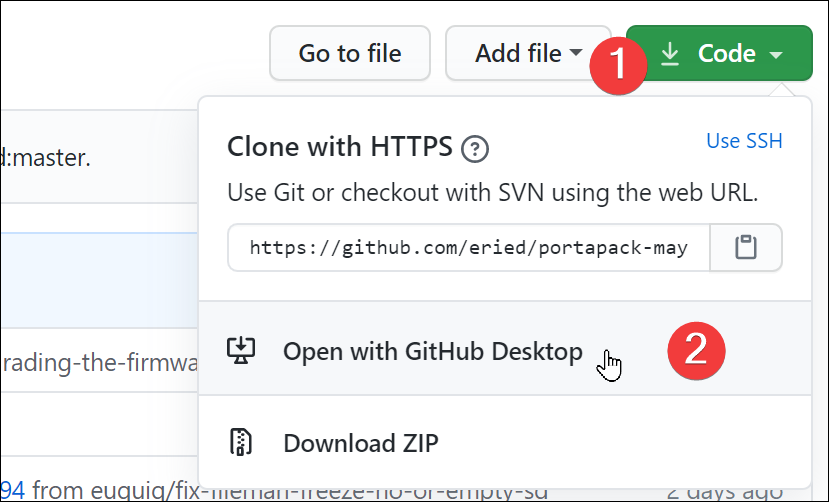
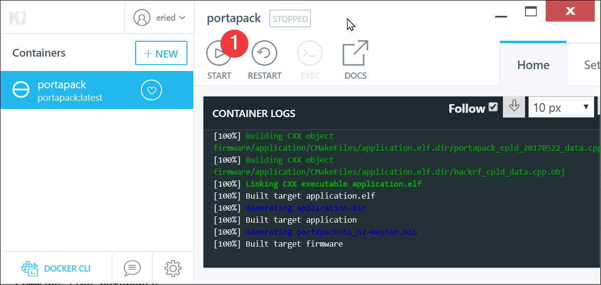

There are severals ways to compile the firmware. As the traditional way, check the original [Building from Source](https://github.com/furrtek/portapack-havoc/wiki/Building-from-source) document, however, Docker is recommended because it provides a very clean way to go from source to a `.bin` file.

# Using Docker Hub and Kitematic

## Step 1: Prepare environment
1. Install [Docker](https://docs.docker.com/get-docker/)
2. Get [Kitematic](https://github.com/docker/kitematic/releases/)
3. Install [GitHub Desktop](https://desktop.github.com/)

## Step 2: Clone the repository

If you are using Windows, line endings may produce some errors. For example: `'python/r' not found` messages are product of a problem with the line endings. To prevent this, configure git to not manipulate these line endings, open a terminal and execute:

`git config --global core.autocrlf false`

You can also check the current configuration by omitting the `false` at the end of the command:




Open Github Desktop, and click "Open with Github Desktop" from the main page of the repository, under the button "Code". 

**Important:** If you want to collaborate to the project, [Fork the repository](How-to-collaborate#fork-the-repository) to your own account and continue this instructions from your own fork.



Finally, create a `build` folder inside of the repository. From Github Desktop, just click "Repository / Show in Explorer" and create an empty folder named `build`. This folder will be used for the compilation output.

## Step 3: Prepare the Docker container
[[img/Kitematic_MChWCyp6g1.png]]

You need to configure the path to the source code from the Volumes of the container as show in the image below. 

[[img/Kitematic_VL5an8rufV.png]]

## Step 4: Compile!

Everytime you run the container you prepared in the previous step, it will compile the source and (if successful) leave the results in `build/firmware/`



If you have additional questions, please check [this guide](Using-MAC-OS).

# Docker - Command line reference

If you are inclined for using the command line, you can try the following:

* For building:
`docker build -t portapackccache -f dockerfile-nogit .`

* For running (in the root of the repo):
`docker run -it -v ${PWD}:/havoc portapackccache`

Remember that you have to create a `build` folder before running the image.

# Using Buddy.Works (and other CI platforms)

You can use the following _yml _as your template for your CI platform (pipeline export from [buddy.works](https://buddy.works/)):

```
- pipeline: "Build firmware"`
  `trigger_mode: "ON_EVERY_PUSH"`
  `ref_name: "master"`
  `ref_type: "BRANCH"`
  `auto_clear_cache: true`
  `trigger_condition: "ALWAYS"`
  `actions:`
  `- action: "Build Docker image"`
    `type: "DOCKERFILE"`
    `dockerfile_path: "dockerfile-nogit"`
    `do_not_prune_images: true`
    `trigger_condition: "ALWAYS"`
  `- action: "Execute: mkdir build"`
    `type: "BUILD"`
    `working_directory: "/buddy/portapack-havoc"`
    `docker_image_name: "library/ubuntu"`
    `docker_image_tag: "18.04"`
    `execute_commands:`
    `- "mkdir -p build"`
    `volume_mappings:`
    `- "/:/buddy/portapack-havoc"`
    `trigger_condition: "ALWAYS"`
    `shell: "BASH"`
  `- action: "Run Docker Image"`
    `type: "RUN_DOCKER_CONTAINER"`
    `use_image_from_action: true`
    `volume_mappings:`
    `- "/:/havoc"`
    `trigger_condition: "ALWAYS"`
    `shell: "SH"
```