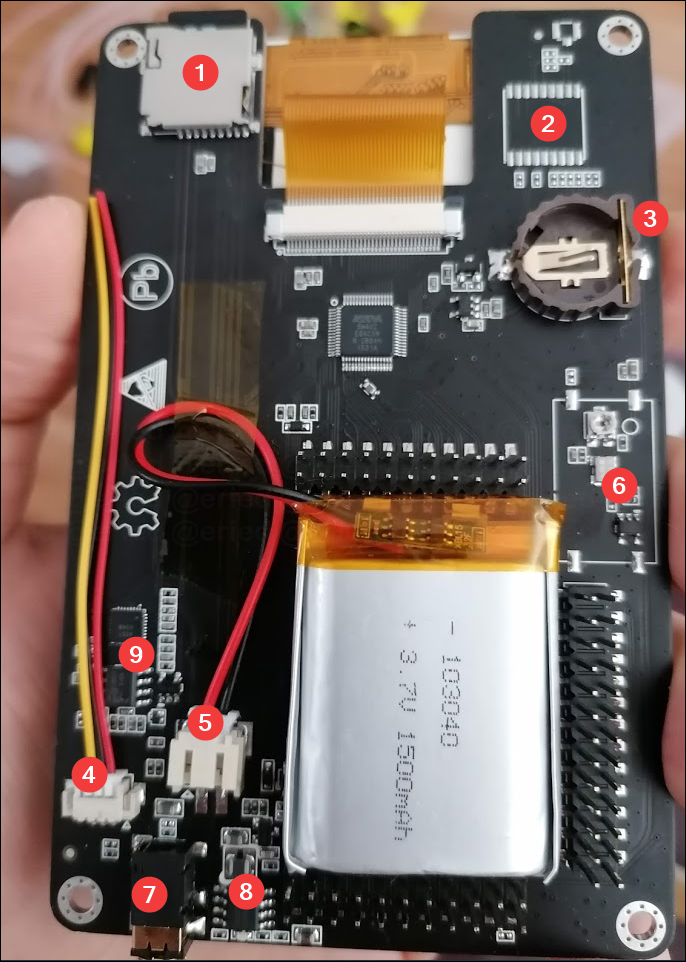

# External

 

1. Antenna (the connector is a _female SMA_, so the antenna needs to be _male SMA_, and not _RPSMA_)
2. Encoder thumb wheel (on the H1 has a different layout, but the same functionality), notice that pushing the wheel down has the same effect as pressing the center push button
3. Directional pushbuttons and Enter/ON/OFF in the center
4. CLK IN
5. CLK OUT
6. Micro usb port and next to it, charging led indicator (in the H2, this might flicker while charging but will _mostly_ turn off when the battery is full)
7. Headset/Microphone (standard smartphone 4 segment 3.5mm connector)
8. Receive and transmit leds (indicates the current operation, since the HackRF is half-duplex, only one of this will be lit at every moment)
9. Other status leds (1.8V: rail status, RF: internal power supply, USB: connection to host is active)
10. DFU mode button (check the [firmware update procedure](Update-firmware#dfu) for details)
11. 3.3V rail status led
12. Reset button

# Portapack internals

1. MicroSD card slot (while in a case, insert the card with the contacts looking to the same direction as the screen)
2. GPS module option (has not been implemented)
3. Memory backup coin cell (compatible with CR1225 or CR1220 in the H2, and with the CR2032 in the H1)
4. [Speaker connector](H2-Enclosure#speaker) (yellow and red go to the speaker coil, black is ground and can be left disconnected)
5. Battery connector
6. TCXO clock (it might be populated with SMD components like in the upper image, unpopulated or populated with a shielded module)
7. Headset/Microphone jack (In case of the H2 the internal speaker switches automatically when the headset is plugged)
8. USB charging circuitry (only the units with battery; this is a standard power bank chipset)
9. Audio amp circuitry