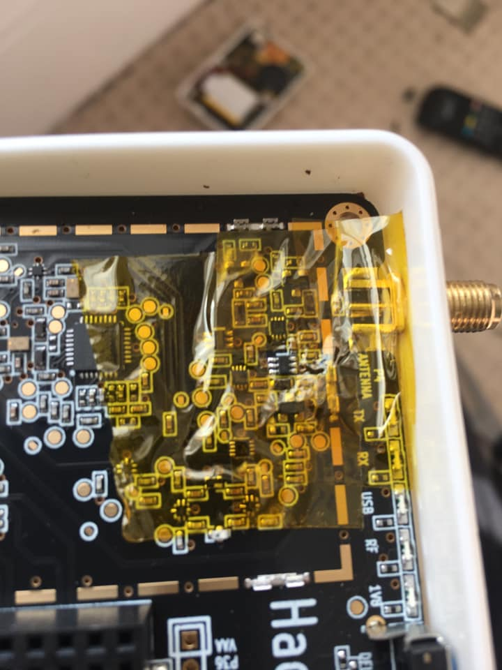

You can damage u13 (MGA-81563) if you use a stronger transmitter near to your HackRF.

It is possible to replace the damaged IC with simple tools (soldering iron, solder wick). First solder flood the damaged component to remove it, preferably protecting the surrounding. Clean the pads and replace the component: 

 