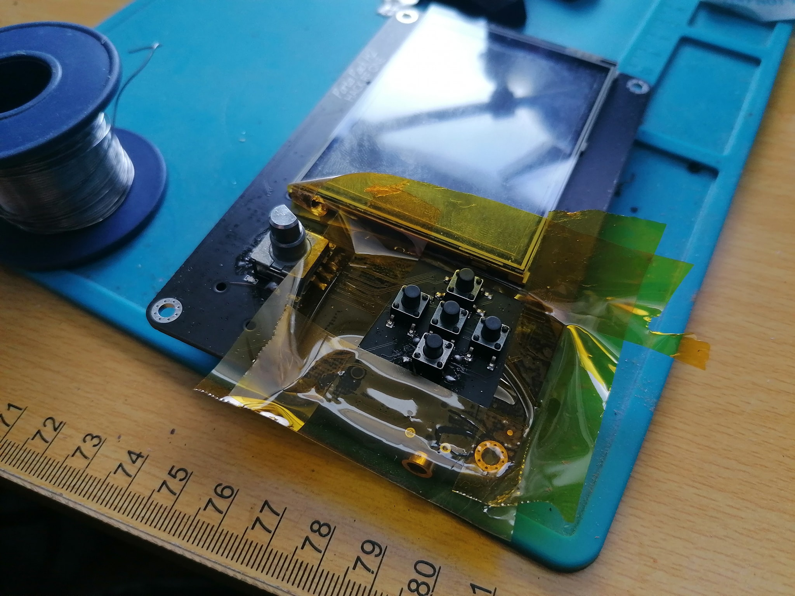

The type of push-buttons used on the Portapack is SMD tactile switches of 6 mm per side and 7 mm of height. You can buy replacements here: https://a.aliexpress.com/item/32699017893.html

The easiest way to remove them is to clip the legs off, clean the pads carefully with solder wick and solder the new buttons. 

You can also find replacement caps for the tactile switches: https://a.aliexpress.com/item/1005001700437278.html
